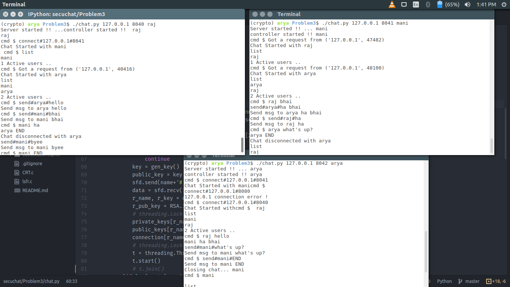

## How To Run this Program


1. Setup the environment

2. First Client runs on port 8040:
    `$ ./chat.py 127.0.0.1. 8040 user1`
3. Second Client runs on port 8041:
    `$ ./chat.py 127.0.0.1 8041 user1`
4. To connect with other user use
    `(cmd $) connect#127.0.0.1#8041`
5. To send a message
    `(cmd $) send#user_name#secret message`
6. To see list of connected users
    `(cmd $) list`
7. To disconnect a chat
    `(cmd $) send#user_name#END`

## To Exit this application
```bash
    # CTRL-C is not going to end this application
    # to do that first do CTRL-Z and then
    ps | grep python | cut -f1 -d" " | xargs kill -9
```
