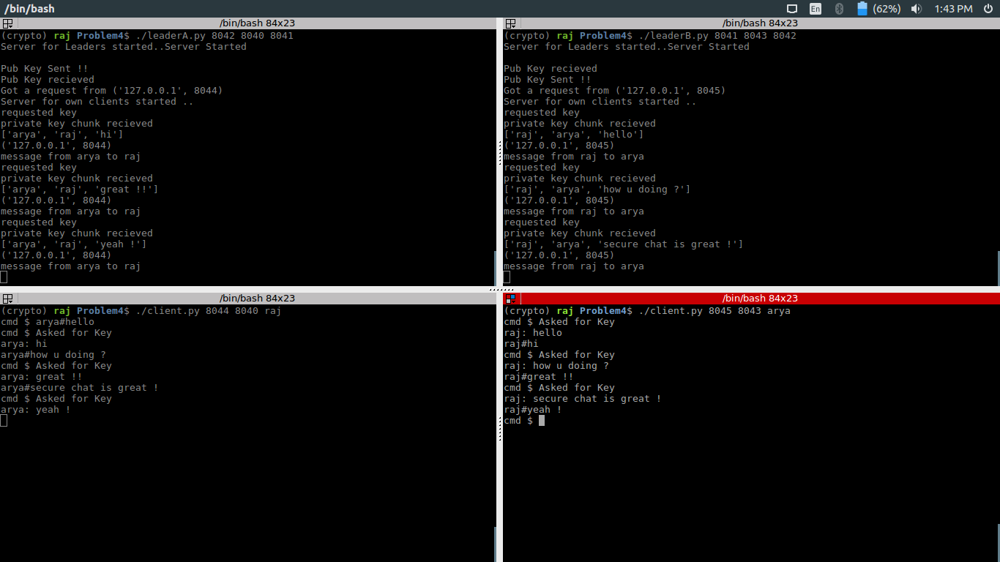

## Secure group chat through a group leader



## Set no. of users in group 

LIMIT = 1 or LIMIT 2

Before sending any messages LIMIT no. of users of connected to each group

### how to run
```
  # Need atleast 4 terminal

  #on first terminal
  ./leaderA.py 8042 8040 8041
  #on second terminal (must run within 5 seconds after first command)
  ./leaderB.py 8041 8043 8042
  #on third terminal (group A)
  ./client.py 8044 8040 raj
  #on fourth terminal (group B)
  ./client.py 8045 8043 arya

```

### how to write message
Send message `reciever_username`#`your message`

### How it works
Whole chat is based on UDP protocol.

>leaderA and leaderB exchanges public key using UDP socket connection.

**Leader A and Leader B accepts limited number of clients specified in respective code with LIMITS**

when a client connects to any group it authenticates user and respective group sends its `private key chunk` to client.

when `leader` gets a message from opposite `leader` it asks for private_key_chunks to each client then makes private key
and decrypts the message and send msgs to required user.

`LIMITS` no. of clients connects to a leader then chat starts.

### This code is full of bugs.

> leaderA is started first & leaderB must be started within 5 second gaps. (which is specified)
